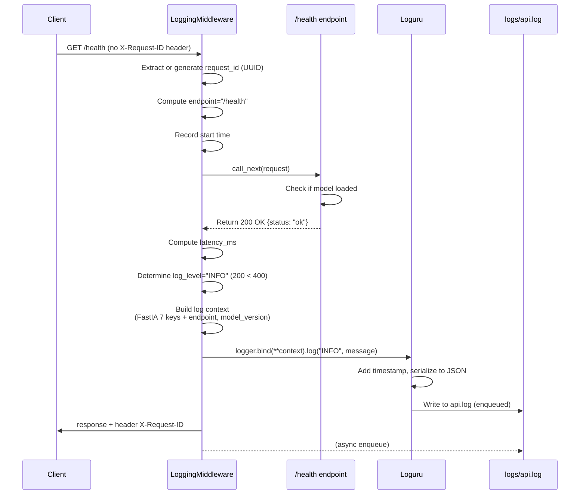

# Logging Architecture — Pyrenex Risk API

## Vue d'ensemble

Le système de logging utilise **Loguru** avec un middleware FastAPI (`LoggingMiddleware`) qui intercepte toutes les requêtes et produit des logs structurés en JSON.

- **Configuration**: fichier rotatif à `logs/api.log` (10 MB, 7 jours de retention)
- **Format**: JSON (`serialize=True`) pour parsing industriel
- **Asynchrone**: `enqueue=True` pour éviter les blocages I/O
- **Header**: `X-Request-ID` dans toutes les réponses (unique ID de requête)

---

## Flux d'une requête `GET /health`



---

## Schéma de log standard (FastIA — 7 clés obligatoires)

Chaque log respecte ces **7 clés**:

| Clé | Type | Source | Exemple |
|-----|------|--------|---------|
| **timestamp** | ISO 8601 | Loguru | `2026-06-03T14:30:45.123456+00:00` |
| **level** | str | Middleware | `"INFO"` \| `"WARNING"` \| `"ERROR"` |
| **method** | str | FastAPI Request | `"GET"` \| `"POST"` |
| **path** | str | FastAPI Request | `"/health"` \| `"/predict"` |
| **status** | int | Response | `200` \| `422` \| `503` |
| **latency__ms** | float | Middleware timing | `2.45` |
| **request__id** | str | Header or UUID | `"550e8400-e29b-41d4-a716-446655440000"` |

### Exemple de log JSON (sérié à `logs/api.log`)

```json
{
  "timestamp": "2026-06-03T14:30:45.123456+00:00",
  "level": "INFO",
  "method": "GET",
  "path": "/health",
  "status": 200,
  "latency__ms": 2.45,
  "request__id": "550e8400-e29b-41d4-a716-446655440000",
  "endpoint": "/health",
  "model_version": "v2.0.0"
}
```

---

## Enrichissements au-delà des 7 clés

### 1. **Endpoint normalisé** (`endpoint`)

**Raison**: Regrouper les logs par endpoint logique plutôt que par chemin exact.

```python
# Extraction du middleware
path_parts = request.url.path.strip("/").split("/")
endpoint = f"/{path_parts[0]}" if path_parts[0] else "/"
```

**Exemples**:
- `GET /health` → `endpoint="/health"`
- `POST /predict` → `endpoint="/predict"`
- `GET /info` → `endpoint="/info"`

### 2. **Model version** (`model_version`)

**Raison**: Tracer quelle version du modèle était active lors de la prédiction.

```python
# Dans le middleware
if hasattr(request.app.state, "metadata") and request.app.state.metadata:
    log_context["model_version"] = request.app.state.metadata.get("model_version")
```

**Impact**: Permet de corréler les prédictions avec la version exacte du modèle.

---

## Sécurité : pas de PII, pas de body

### ✅ Ce qui est loggé
- Headers de métadonnées: `method`, `path`, `status`, `latency__ms`
- Request ID technique: `request__id`, `X-Request-ID`
- Contexte applicatif: `endpoint`, `model_version`

### ❌ Ce qui n'est jamais loggé
- **Request body**: données utilisateur, tokens, secrets
- **Response body**: sensibilités métier
- **PII**: email, phone, address (même hashés)
- **Credentials**: Authorization headers (excepté pour routing de sécurité)

**Loguru `serialize=True`** s'assure que seuls les champs bindés sont sérialisés — aucun accès automatique au contexte de la requête.

---

## Configuration en `main.py`

```python
logger.remove()  # Enlever la config par défaut

logger.add(sys.stderr, level="INFO", colorize=True)  # Console (dev)

logger.add(
    LOGS_DIR / "api.log",
    rotation="10 MB",          # Roter à 10 MB
    retention="7 days",        # Garder 7 jours
    compression="gz",          # Compresser archives
    serialize=True,            # JSON structuré
    enqueue=True,              # Asynchrone (thread-safe)
    level="INFO",              # Seuil minimal
)
```

---

## Exemple : trace complète d'une requête `/predict` réussie

### Requête
```bash
curl -X POST http://127.0.0.1:8000/predict \
  -H "Content-Type: application/json" \
  -H "X-Request-ID: my-request-123" \
  -d '{"loan_amnt": 10000, ..., "revol_util": 45.2}'
```

### Log généré
```json
{
  "timestamp": "2026-06-03T14:31:22.567890+00:00",
  "level": "INFO",
  "method": "POST",
  "path": "/predict",
  "status": 200,
  "latency__ms": 15.67,
  "request__id": "my-request-123",
  "endpoint": "/predict",
  "model_version": "v2.0.0"
}
```

### Trace complète du flux
1. Client envoie POST avec `X-Request-ID: my-request-123`
2. Middleware reçoit, accepte `my-request-123` (vient du header)
3. `dispatch()` mesure le temps: `t_start = perf_counter()`
4. Route `/predict` s'exécute (⏱ ~15 ms)
5. Middleware calcule `latency__ms = 15.67`
6. Log level = "INFO" car status 200 < 400
7. Contexte complet bindé à Loguru + model_version rajoutée
8. **JSON écrit à `logs/api.log`** (enqueued asynchrone)
9. Header `X-Request-ID: my-request-123` retourné au client

---

## Test du middleware

### Vérification que les logs contiennent les 7 clés
```bash
pytest tests/test_api.py -v
# Tous les tests passent (health, predict, etc.)
```

### Inspection du fichier de log
```bash
tail -f logs/api.log | python -m json.tool
# Chaque ligne est un JSON valide avec 7 clés + enrichissements
```

---

## Justification des choix

| Choix | Justification |
|-------|---------------|
| **Loguru** | Async-ready, JSON natif, rotation simple |
| **serialize=True** | Logs structurés → queryable en production |
| **enqueue=True** | Pas de blocage I/O sur requête sensible |
| **10 MB rotation** | Équilibre: lisibilité + stockage (raid disque) |
| **7 jours retention** | RGPD: pas de logs "pour toujours" |
| **X-Request-ID partout** | Traçabilité bout-à-bout (client → logs → metrics) |
| **endpoint normalisée** | Agrégation en observabilité (Datadog, ELK) |
| **model_version dans logs** | Débugging post-mortem: quelle version a prédis ? |

---

## Évolution future (M5+)

- **Metrics**: compteur d'appels par endpoint (Prometheus)
- **Sampling**: réduire volume pour /health à 10% en production
- **Contexte de base de données**: bind `db_query_count` pour /predict
- **OTEL**: OpenTelemetry pour exportation vers backend centralisé
