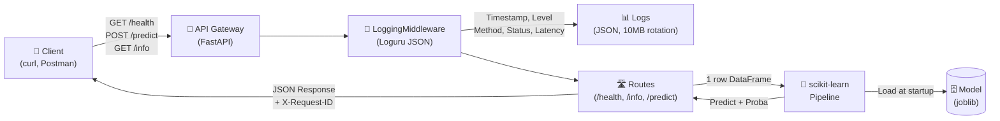

# M1-B2 — Pyrenex Crédit Risk Scoring API

**Production-ready FastAPI service** exposing a credit-risk ML model (scikit-learn) with structured logging, Docker containerization, and comprehensive testing.

Model version: **v2.0.0** | API version: **0.1.0** | Tag: **v0.1.0-api**

---

## Architecture (Mermaid)



**Flow**: Client sends JSON → Middleware intercepts (logs, assigns request_id) → Route validates & converts to DataFrame → Model predicts → Response with metadata.

---

## Démarrage rapide (3 commandes Docker)

### Avec Docker (production-like)

```bash
# 1. Build image
docker build -t M1-B2-scoring-api-franck .

# 2. Run container
docker run -d --name api -p 8000:8000 M1-B2-scoring-api-franck

# 3. Verify health
curl http://localhost:8000/health
```

### Sans Docker (local dev)

```bash
pip install -r requirements.txt
uvicorn app.main:app --reload
curl http://localhost:8000/health
```

---

## API Examples

### `GET /health` — Liveness Check

```bash
curl -i http://localhost:8000/health
```

**Response** (200 OK):
```json
{
  "status": "ok"
}
```

Header `X-Request-ID: <uuid>` is always returned.

### `POST /predict` — Risk Scoring

```bash
curl -X POST http://localhost:8000/predict \
  -H "Content-Type: application/json" \
  -d '{
    "loan_amnt": 7600,
    "term": "36 months",
    "int_rate": 11.39,
    "installment": 250.22,
    "grade": "B",
    "emp_length": "3 years",
    "home_ownership": "MORTGAGE",
    "annual_inc": 72500,
    "verification_status": "Verified",
    "purpose": "debt_consolidation",
    "dti": 13.12,
    "delinq_2yrs": 1,
    "fico_range_low": 725,
    "revol_util": 48.0
  }'
```

**Response** (200 OK):
```json
{
  "prediction": 0,
  "probability": 0.342,
  "model_version": "v2.0.0",
  "request_id": "550e8400-e29b-41d4-a716-446655440000"
}
```

**Fields**:
- `prediction`: 0 = Fully Paid, 1 = Charged Off
- `probability`: risk probability [0.0, 1.0]
- `model_version`: deployed model version
- `request_id`: unique trace ID for logs

### `GET /info` — Model Metadata

```bash
curl http://localhost:8000/info
```

**Response** (200 OK):
```json
{
  "api_version": "0.1.0",
  "model_name": "pyrenex_risk_v2",
  "model_version": "v2.0.0",
  "created_at": "2026-06-02T13:08:19.521293+00:00",
  "sklearn_version": "1.5.1",
  "dataset_sha256": "d2da093bee40024b196e73a0d2d763193782f947e3d60552a3d7bbad0bd944e3",
  "metrics_holdout": {
    "roc_auc": 0.7348,
    "f1_macro": 0.6108,
    "confusion_matrix": [[3429, 1468], [389, 714]]
  }
}
```

---

## Versioning

### Where to find versions

| Version | Location | Command |
|---------|----------|---------|
| **API** | Response `/info.api_version` | `curl localhost:8000/info \| jq .api_version` |
| **Model** | Response `/info.model_version` | `curl localhost:8000/info \| jq .model_version` |
| **Git** | Tag `v0.1.0-api` | `git tag` or `git log --oneline --decorate` |
| **Dockerfile** | Image tag | `docker images \| grep M1-B2` |

### Semantic Versioning

- **API**: `MAJOR.MINOR.PATCH` (routes, schemas)
- **Model**: `vMAJOR.MINOR.PATCH` (from M1-B1 training)
- **Git tags**: `v<API_VERSION>-api` (release marker)

---

## Testing

### Local (before Docker)

```bash
# Contract test (model signature validation)
pytest tests/test_model_contract.py -v

# API tests (routes + edge cases)
pytest tests/test_api.py -v

# All tests
pytest -v
```

### In Container (with volume mount)

```bash
docker run --rm -v $(pwd)/tests:/home/appuser/app/tests \
  M1-B2-scoring-api-franck pytest -v
```

---

## Logging

All requests are logged as **structured JSON** to `logs/api.log` with:

**FastIA 7-key schema**:
- `timestamp`, `level`, `method`, `path`, `status`, `latency__ms`, `request__id`

**Enrichments**:
- `endpoint`: normalized route (/health, /predict, /info)
- `model_version`: active model version during request

**Sample log** (GET /health 200):
```json
{
  "timestamp": "2026-06-03T14:30:45.123456+00:00",
  "level": "INFO",
  "method": "GET",
  "path": "/health",
  "status": 200,
  "latency__ms": 2.45,
  "request__id": "550e8400-e29b-41d4-a716-446655440000",
  "endpoint": "/health",
  "model_version": "v2.0.0"
}
```

See [LOGGING.md](./LOGGING.md) for complete architecture and flow diagram.

---

## M5 Preview (Token-based Auth)

- **HTTPBearer enforcement**: Make Bearer token validation mandatory (currently optional)
- **Token generation**: Service account key management (e.g. GitHub Actions)
- **Prometheus metrics**: Endpoint call counters, latency histograms
- **Sampling**: Reduce /health logs to 10% in production
- **OpenTelemetry**: Export traces to centralized backend (Datadog, Jaeger)

---

## Structure du repo

```
M1-B2-scoring-api-franck/
├── app/
│   ├── __init__.py
│   ├── main.py                  # FastAPI app + lifespan + routes
│   ├── schemas.py               # Pydantic schemas (LoanApplication, Prediction)
│   └── middleware.py            # LoggingMiddleware Loguru
├── tests/
│   ├── __init__.py
│   ├── conftest.py              # fixtures pytest (client + valid_payload)
│   ├── test_model_contract.py   # test 0 — valide le .joblib avant l'API
│   └── test_api.py              # tests routes /health, /info, /predict
├── models/                      # ton .joblib + .json depuis M1-B1
│   └── .gitkeep
├── logs/                        # logs rotatifs (gitignored)
│   └── .gitkeep
├── ressources/                  # mini-cours d'appui (lecture juste-à-temps)
│   ├── 01_FastAPI_Pydantic_ml_essentiel.md
│   ├── 02_Dockerfile_Python_essentiel.md
│   ├── 03_Pytest_TestClient_essentiel.md
│   ├── 04_Loguru_middleware_essentiel.md
│   ├── 05_Versionning_modele_essentiel.md
│   ├── liens_officiels.md
│   └── README.md
├── Dockerfile                   # Production-ready
├── .dockerignore
├── .gitignore
├── requirements.txt
├── LOGGING.md                   # Logging architecture + Mermaid diagram
└── README.md (ce fichier)
```

---

## Troubleshooting

1. **Swagger** : `http://localhost:8000/docs` — Try routes interactively.
2. **Logs** : `tail -f logs/api.log` — Track requests in real-time.
3. **Docker health** : `docker ps` — Check if container shows `(healthy)` after 30s.
4. **Model missing** : Ensure `models/pyrenex_risk_v2.{joblib,json}` exist.
5. **Port conflict** : Use `lsof -i :8000` to find blocking process.

See [`./ressources/`](./ressources/) for detailed mini-courses.
